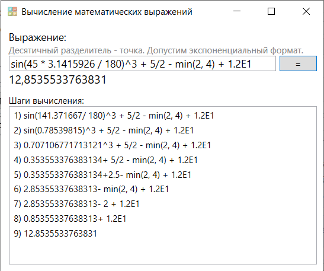

# Math-Expression-Evaluation

Данный проект предназначен для вычисления математических и тригонометрческих вычислений выражений, записанных в простом текстовом формате. Это доработка кода из книги Франческо Балены "Программирование на Microsoft Visual Basic 2005".

Доработка заключается в том, что данный вычислитель распознаёт кроме целых чисел и чисел с плавающей точкой таже числа, представленные в экспоненциальном (научном) формате. Кроме того, десятичным разделителем мжет выступать не только точка, но и запятая - это имеет значение при запуске кода на ПК с различными языковыми настройками.

Пример расчёта:

